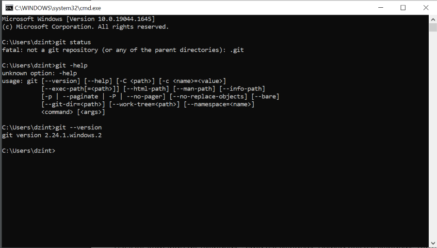
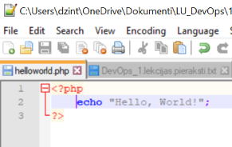

# devops
[Dzintars Rerihs](gitrepo) devops [repositary](https://github.com/dzintarsrerihs/devops)

_Some screenshots from first task_

## Git installed

## Editor with PHP code

For markdown sysntax check [this site](https://www.markdownguide.org/basic-syntax/)

[gitrepo]: <https://github.com/dzintarsrerihs/devops>